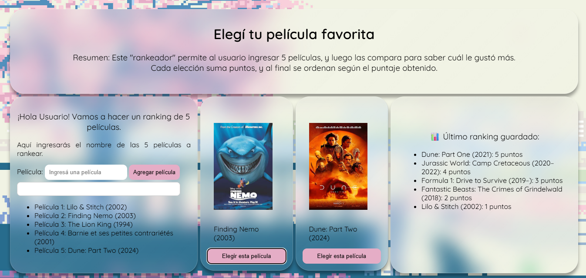

# 🎬 Rank-Pelis

¡Bienvenidx a **Rank-Pelis**!  
Una aplicación web para buscar, agregar y rankear tus películas favoritas usando la API de OMDb.  
Ideal para cinéfilos que quieran llevar su propio ranking personalizado de películas.

---

## 🚀 Funcionalidades

🔍 Búsqueda de películas por nombre (usando la API de OMDb).
⭐ Agregar hasta 5 películas a tu ranking.
🎨 Interfaz interactiva.
🎲 Sistema de puntaje y orden por preferencia.

---

## 🛠️ Tecnologías

- HTML5.
- CSS3.
- JavaScript (ES6+).
- [OMDb API](https://www.omdbapi.com/) para obtener datos de películas.
- [SweetAlert2](https://sweetalert2.github.io/) y [Toastify](https://github.com/apvarun/toastify-js) para alertas personalizadas.

:)
